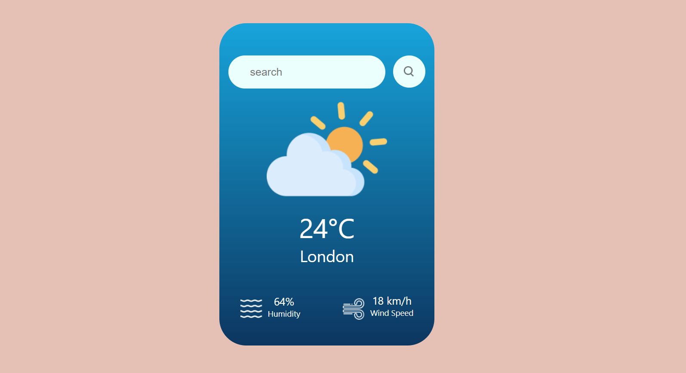

# Weather App



## Description

This is a simple weather app built with React that allows users to check the current weather conditions for a specific city. It fetches data from the OpenWeatherMap API and displays information such as temperature, humidity, wind speed, and an icon representing the weather condition.

## Features

- Real-time weather data
- Search for weather information by city
- Dynamic weather icons based on the current conditions

## Installation

1. Clone the repository:

   ```bash
   git clone https://github.com/your-username/weather-app.git


# Install dependencies:
cd weather-app
npm install


# Obtain an API key from OpenWeatherMap and replace YOUR_API_KEY in the code with your actual API key.

# Start the app:

npm start
